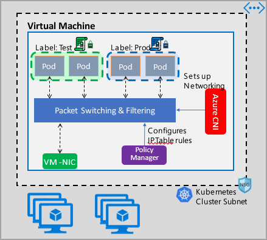

## Azure NPM (Azure Network Policy Manager)

Azure NPM (Azure Network Policy Manager) is a component used in Azure Kubernetes Service (AKS) clusters to enforce Kubernetes Network Policies.

It allows you to control which pods can communicate with each other inside a Kubernetes cluster.

## Purpose Of Azure NPM

By default In the CLuster, Pod can communicate with each-other

Testing environment, We can allow to have pod --> pod communication, in the production environment we can't allow this behaviour, so we have the plugin Azure NPM which used to control the traffic between different pods.

## Microsoft is gradually moving away from Azure NPM.

| Feature                  | Azure NPM | Calico   |
| ------------------------ | --------- | -------- |
| Policy engine            | Azure     | Calico   |
| Performance              | Moderate  | High     |
| Advanced policies        | Limited   | Advanced |
| eBPF support             | No        | Yes      |
| Recommended by Azure now | ❌ No      | ✅ Yes    |

